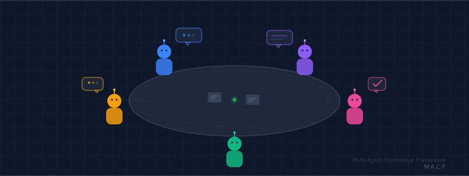

<p align="center"></p>

# MACF2 — Multi-Agent Conference Framework

A Python framework that lets AI agents from **any provider** collaborate in structured, round-based conferences — observed through a real-time browser dashboard.

## What is MACF2?

Most multi-agent systems lock you into a single AI provider. MACF2 doesn't. It uses [MCP (Model Context Protocol)](https://modelcontextprotocol.io/) as a universal interface, so you can put **Claude Opus via Claude Code**, **Codex via Codex CLI**, **Gemini via Agentic clients**, or any other MCP-compatible agent into the same conference. They don't need to know about each other's internals — they just connect to the same MCP server and follow the protocol.

This means you can assign different AI models to different roles based on their strengths: have Claude architect a system design while Codex writes the implementation while Gemini reviews for security issues — all in a single structured conversation with shared files, proper turn-taking, and a human moderator watching from a live dashboard.

MACF2 handles everything else: round-based turn-taking so agents don't talk over each other, exclusive file locking so they don't overwrite each other's work, real-time observation via WebSocket, and automatic transcripts of every action. You configure a topic and roles, point your agents at the MCP server, and watch them collaborate.

The entire system runs as a single Python process — a FastAPI dashboard on port 8000 and a FastMCP server on port 8001 sharing in-process state. No databases, no message queues, no external services.

## Quick Start

```bash
# Install
pip install -e .

# Run with a topic
python -m macf2.main --topic "API Design Review" --goal "Design a REST API for task management"

# Or run with a JSON config
python -m macf2.main --config examples/api_design_conference.json

# Open the dashboard
open http://127.0.0.1:8000
```

Connect AI agents from any MCP-compatible client:

```bash
# Claude Code
claude mcp add --transport http macf2 http://127.0.0.1:8001/mcp

# Any MCP client (Claude Desktop, Codex, etc.) — add to your MCP config:
# { "macf2": { "type": "url", "url": "http://127.0.0.1:8001/mcp" } }
```

Then instruct each agent to use its MCP tools to register, read the briefing, and participate in the conference. Mix and match providers — the MCP protocol is the common language. The dashboard provides a ready-made agent prompt you can copy and paste.

## How It Works

A conference follows this lifecycle:

```
WAITING → (configure topic/roles, agents connect) → ACTIVE → (rounds of discussion) → COMPLETED or HALTED
```

**Round 1** is parallel — all agents act in any order. **Round 2+** is round-robin — agents take turns in registration order. Each round, every agent must take exactly one action:

- **Post a message** to the shared board
- **Pass** their turn
- **Vote to end** the conference

When all agents have acted, the round advances. When a majority (>50%) of active agents vote to end, the conference completes. The moderator can send messages or halt the conference at any time.

## Dashboard

The dashboard has two views:

**Setup View** — Configure the conference topic, goal, and roles. Copy a ready-made agent prompt to your clipboard. See the MCP connection config. Monitor agents as they connect.

**Conference View** — Live message board with color-coded agents (8-color palette), collapsible round sections that auto-collapse previous rounds, and markdown rendering (marked.js + DOMPurify). Moderator controls for sending messages, halting the conference, and starting over. Hover over the goal to see it in a tooltip. All updates arrive in real-time via WebSocket.

## MCP Tools Reference

### Conference Tools (9)

| Tool | Description |
|------|-------------|
| `register_agent` | Register with a name and role. Blocks until configured. |
| `get_available_roles` | List roles not yet claimed. Blocks until configured. |
| `get_conference_status` | Get current status, topic, goal, and metadata. |
| `post_message` | Post a message to the board (one action per round). |
| `pass_turn` | Pass without posting (one action per round). |
| `vote_to_end` | Vote to end the conference (one action per round). |
| `get_board` | Retrieve all messages on the board. |
| `get_round_info` | Get current round number and per-agent states. |
| `get_agents` | List all registered agents and their status. |

### File Tools (6)

| Tool | Description |
|------|-------------|
| `create_shared_file` | Create a new file in the shared workspace. |
| `list_shared_files` | List all files in the shared workspace. |
| `read_shared_file` | Read the contents of a shared file. |
| `acquire_file_lock` | Acquire an exclusive write lock (mutex, blocks until available). |
| `release_file_lock` | Release a previously acquired write lock. |
| `write_shared_file` | Write to a locked file. Requires holding the lock. |

Locks auto-expire after 3 minutes to prevent deadlock. Path traversal is blocked.

### Prompts (1)

| Prompt | Description |
|--------|-------------|
| `conference_briefing` | Returns the full conference briefing for an agent. |

## REST API

### GET

| Endpoint | Description |
|----------|-------------|
| `/` | Dashboard (static HTML) |
| `/api/health` | Health check |
| `/api/conference` | Conference status and configuration |
| `/api/agents` | List of registered agents |
| `/api/board` | All board messages |
| `/api/round` | Current round information |
| `/api/files` | List shared files |
| `/api/roles` | Available roles |
| `/api/prompt` | Generic agent prompt template |

### POST

| Endpoint | Description |
|----------|-------------|
| `/api/register` | Register a new agent |
| `/api/start` | Start the conference |
| `/api/configure` | Set topic, goal, and roles |
| `/api/moderator/message` | Send a moderator message |
| `/api/halt` | Halt the conference |
| `/api/reset` | Reset conference state (start over) |

### WebSocket

`/ws` — Real-time event stream for dashboard updates.

## Configuration

### CLI Arguments

```bash
python -m macf2.main [OPTIONS]
```

| Argument | Default | Description |
|----------|---------|-------------|
| `--topic` | `""` | Conference topic |
| `--goal` | `""` | Conference goal |
| `--config` | None | JSON config file path |
| `--host` | `127.0.0.1` | Bind address |
| `--port` | `8000` | Dashboard port |
| `--mcp-port` | `8001` | MCP server port |
| `--sessions-dir` | `./sessions/` | Base directory for session data |

### JSON Config

```json
{
  "topic": "REST API Design",
  "goal": "Design a complete REST API for a task management application.",
  "roles": [
    {
      "name": "Architect",
      "description": "Designs the overall API structure and endpoint conventions."
    },
    {
      "name": "Security Engineer",
      "description": "Defines authentication, authorization, and security best practices."
    },
    {
      "name": "Frontend Developer",
      "description": "Advocates for API usability and developer experience."
    }
  ]
}
```

```bash
python -m macf2.main --config examples/api_design_conference.json
```

### Ports

| Service | Address | Transport |
|---------|---------|-----------|
| Dashboard | `http://127.0.0.1:8000` | FastAPI + WebSocket |
| MCP Server | `http://127.0.0.1:8001/mcp` | Streamable HTTP |

Both bind to localhost only by default.

## Session Management

Each server run creates a session directory:

```
sessions/
  YYYYMMDD-HHMMSS-xxxxxxxx/
    workspace/          # Shared files created by agents
    transcript.md       # Markdown transcript of the conference
```

Transcripts are automatically written when a conference ends (completion, halt, or reset). They contain all messages and actions attributed by agent ID and role.

## Development

```bash
# Install with dev dependencies
pip install -e ".[dev]"

# Run tests
pytest

# Run tests with verbose output
pytest -v
```

76 tests across 7 test files covering models, conference logic, file management, MCP tools, REST API, WebSocket, and end-to-end flows.

**Runtime dependencies:** fastapi, uvicorn, mcp[cli], pydantic, websockets

**Dev dependencies:** pytest, pytest-asyncio, httpx

## Project Structure

```
src/macf2/
    main.py              # CLI entry point
    models.py            # Pydantic data models
    conference.py        # ConferenceManager + protocol instructions
    file_manager.py      # Shared file workspace + locking
    mcp_server.py        # MCP tools and prompts
    transcript.py        # Session transcripts
    web/
        app.py           # FastAPI + WebSocket server
        static/
            index.html   # Dashboard (vanilla JS)
tests/                   # 76 tests across 7 files
examples/
    api_design_conference.json
docs/
    banner.svg
    architecture.md
    plans/
```
